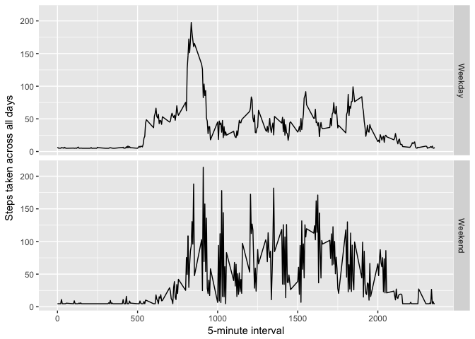

### Loading Data & Pre-processing 


```r
tracker_data <- read.csv("activity.csv")
summary(tracker_data)   #steps, date, and interval var
```

```
##      steps                date          interval     
##  Min.   :  0.00   2012-10-01:  288   Min.   :   0.0  
##  1st Qu.:  0.00   2012-10-02:  288   1st Qu.: 588.8  
##  Median :  0.00   2012-10-03:  288   Median :1177.5  
##  Mean   : 37.38   2012-10-04:  288   Mean   :1177.5  
##  3rd Qu.: 12.00   2012-10-05:  288   3rd Qu.:1766.2  
##  Max.   :806.00   2012-10-06:  288   Max.   :2355.0  
##  NA's   :2304     (Other)   :15840
```

### What is mean total number of steps taken per day?

1. Calculate total number of steps taken per day

```r
daily_data <- tapply(tracker_data$steps, tracker_data$date, sum, na.rm= TRUE)
sum(daily_data)
```

```
## [1] 570608
```
Total number of steps taken per day is 570608. 

2. Histogram of Steps per day

```r
library(ggplot2)

qplot(daily_data, geom="histogram",
      main="Mean total number of steps/day",
      xlab = "Steps", ylab="Count",
      bins= 50, col=I("black"))
```

<!-- -->

3. Mean and Median of total number of steps taken per day:

```r
mean(daily_data)
```

```
## [1] 9354.23
```

```r
median(daily_data)
```

```
## [1] 10395
```

### What is the average daily activity pattern?
 1. Make a time series plot (i.e. 𝚝𝚢𝚙𝚎 = "𝚕") of the 5-minute interval (x-axis) and the average number of steps taken, averaged across all days (y-axis)


```r
avg <- aggregate(x= list(step =tracker_data$steps), 
                 by=list(int = tracker_data$interval),
                 FUN= mean, na.rm=TRUE)
ggplot(avg, aes(avg$int, avg$step)) + geom_line() +
    labs(x="5-minute interval",
         y="Steps taken across all days")
```

<!-- -->

2. Which 5-minute interval, on average across all the days in the dataset, contains the maximum number of steps?

```r
avg[which.max(avg$step),]
```

```
##     int     step
## 104 835 206.1698
```

### Imputing missing values

1. Calculate and report the total number of missing values in the dataset (i.e. the total number of rows with 𝙽𝙰s)

```r
table(!complete.cases(tracker_data))
```

```
## 
## FALSE  TRUE 
## 15264  2304
```
2. Devise a strategy for filling in all of the missing values in the dataset. The strategy does not need to be sophisticated. For example, you could use the mean/median for that day, or the mean for that 5-minute interval, etc.
Create a new dataset that is equal to the original dataset but with the missing data filled in.


```r
for(i in 1:ncol(tracker_data)) {
    tracker_data[is.na(tracker_data[,i]), i] <- mean(tracker_data[,i], na.rm = TRUE)
}
```

```
## Warning in mean.default(tracker_data[, i], na.rm = TRUE): argument is not
## numeric or logical: returning NA
```

```r
table(complete.cases(tracker_data))
```

```
## 
##  TRUE 
## 17568
```


3. Make a histogram of the total number of steps taken each day and Calculate and report the mean and median total number of steps taken per day. 

```r
daily_data_2 <- tapply(tracker_data$steps, tracker_data$date, sum)
qplot(daily_data_2, geom="histogram", color=I("black"))
```

<!-- -->


```r
mean(daily_data_2)
```

```
## [1] 10766.19
```

```r
median(daily_data_2)
```

```
## [1] 10766.19
```

4. What is the impact of imputing missing data on the estimates of the total daily number of steps?

The impact of imputing missing data values is that it increases both the mean and 
median in the dataframe. This is because we now have more values to calculate the mean and median with, and this influences the mean and median more than a zero or NA value. 

### Are there differences in activity patterns between weekdays and weekends?

```r
# tracker_data$weekend <- as.factor()
tracker_data$weekday <- weekdays(as.POSIXct(tracker_data$date))
tracker_data$weekday[tracker_data$weekday == c("Saturday", "Sunday")]<- "Weekend"
tracker_data$weekday[tracker_data$weekday != "Weekend"]<- "Weekday"
#table(tracker_data$weekday)
```

1. Make a panel plot containing a time series plot (i.e. 𝚝𝚢𝚙𝚎 = "𝚕") of the 5-minute interval (x-axis) and the average number of steps taken, averaged across all weekday days or weekend days (y-axis)

```r
avg2 <- aggregate(steps ~ interval + weekday, data= tracker_data,
                 FUN =mean)

ggplot(avg2, aes(avg2$int, avg2$step)) + geom_line() +
    facet_grid(weekday ~.)+
    labs(x="5-minute interval",
         y="Steps taken across all days")
```

<!-- -->

