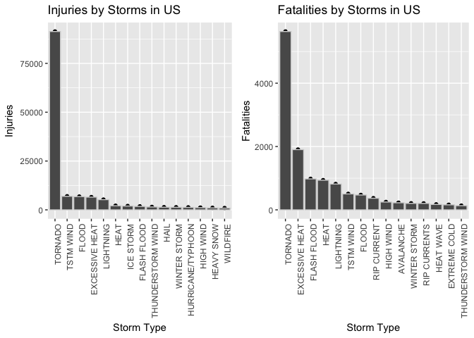
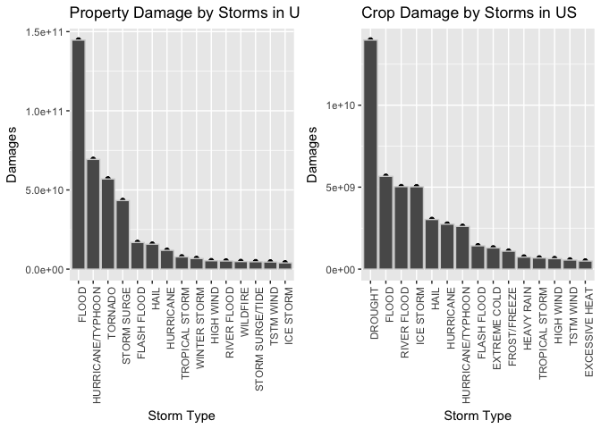

# The Effect of Storms in the United States on Public Health & Economic Settings 

## Synopsis
Any form of severe weather and storm can have a significant impact on the locations that they hit. This report aims to analyze data from the U.S. National Oceanic and Atmospheric Administration's (NOAA) storm database and provide a summary of public health and economic impacts.

## Data Processing 

#### Loading data & examining variable names 
This is an essential step in the data analysis process to determine which variables contain the information we seek to extract. 

```r
storm_data <- read.csv("repdata%2Fdata%2FStormData.csv")
names(storm_data)
```

```
##  [1] "STATE__"    "BGN_DATE"   "BGN_TIME"   "TIME_ZONE"  "COUNTY"    
##  [6] "COUNTYNAME" "STATE"      "EVTYPE"     "BGN_RANGE"  "BGN_AZI"   
## [11] "BGN_LOCATI" "END_DATE"   "END_TIME"   "COUNTY_END" "COUNTYENDN"
## [16] "END_RANGE"  "END_AZI"    "END_LOCATI" "LENGTH"     "WIDTH"     
## [21] "F"          "MAG"        "FATALITIES" "INJURIES"   "PROPDMG"   
## [26] "PROPDMGEXP" "CROPDMG"    "CROPDMGEXP" "WFO"        "STATEOFFIC"
## [31] "ZONENAMES"  "LATITUDE"   "LONGITUDE"  "LATITUDE_E" "LONGITUDE_"
## [36] "REMARKS"    "REFNUM"
```

#### Exploratory Data Analysis

- Subsetting data to columns of interest
This is to reduce the size of the data frame that is worked with to improve computational processing times.

```r
storm_table <- storm_data[, c("STATE", "EVTYPE", "FATALITIES", 
                           "INJURIES", "BGN_DATE", "BGN_TIME", "PROPDMGEXP",
                           "CROPDMGEXP", "PROPDMG", "CROPDMG")]
```

- Examining occurrence of storm related fatalities by the numbers 
This step involves adding fatalities for each storm across locations. A plot is also created with the top 15 storms with the highest number of fatalities. A similiar approach is done below when calculating injuries by storm types. 

```r
library(ggplot2)
library(plyr)

storm_fatal_counts <- aggregate(storm_table$FATALITIES, by=list(storm_table$EVTYPE), FUN=sum)
storm_fatal_counts <- head(arrange(storm_fatal_counts,desc(x)), n = 15)

fatalities <- qplot(data=storm_fatal_counts, x = reorder(Group.1, -x),  y=x) + 
    theme(axis.text.x = element_text(angle = 90, hjust = 1)) + 
    geom_bar(color="light gray", stat="identity",) + 
    xlab("Storm Type") + 
    ylab("Fatalities") + 
    ggtitle("Fatalities by Storms in US")
```

- Examining occurrence of storm related injuries by the numbers 

```r
storm_injury_counts <- aggregate(storm_table$INJURIES, by=list(storm_table$EVTYPE), FUN=sum)
storm_injury_counts <- head(arrange(storm_injury_counts,desc(x)), n = 15)

injuries <- qplot(data=storm_injury_counts, x = reorder(Group.1, -x),  y=x) + 
    theme(axis.text.x = element_text(angle = 90, hjust = 1)) + 
    geom_bar(color="light gray", stat="identity",) + 
    xlab("Storm Type") +
    ylab("Injuries") + 
    ggtitle("Injuries by Storms in US")
```

- Correcting Property & Crop Damage Costs

##### Property Damage (code conversion)

The data that was obtained from the NOAA had property and damage codes that were supposed to be exponents for values in the "PROPDMG" and "CROPDMG" columns. The codes are converted to their numeric forms to obtain accurate damage values.Subsequent plots are created to display the top 15 storms that cause the most property and crop damages. 

```r
print(unique(storm_table$PROPDMGEXP))
```

```
##  [1] K M   B m + 0 5 6 ? 4 2 3 h 7 H - 1 8
## Levels:  - ? + 0 1 2 3 4 5 6 7 8 B h H K m M
```

```r
storm_table$prop_damg [storm_table$PROPDMGEXP == "B"] <- 1e+09
storm_table$prop_damg [storm_table$PROPDMGEXP == "8"] <- 1e+08
storm_table$prop_damg [storm_table$PROPDMGEXP == "7"] <- 1e+07
storm_table$prop_damg [storm_table$PROPDMGEXP == "m"] <- 1e+06
storm_table$prop_damg [storm_table$PROPDMGEXP == "M"] <- 1e+06
storm_table$prop_damg [storm_table$PROPDMGEXP == "6"] <- 1e+06
storm_table$prop_damg [storm_table$PROPDMGEXP == "5"] <- 1e+05
storm_table$prop_damg [storm_table$PROPDMGEXP == "4"] <- 10000
storm_table$prop_damg [storm_table$PROPDMGEXP == "K"] <- 1000
storm_table$prop_damg [storm_table$PROPDMGEXP == "3"] <- 1000
storm_table$prop_damg [storm_table$PROPDMGEXP == "2"] <- 100
storm_table$prop_damg [storm_table$PROPDMGEXP == "h"] <- 100
storm_table$prop_damg [storm_table$PROPDMGEXP == "H"] <- 100
storm_table$prop_damg [storm_table$PROPDMGEXP == "1"] <- 10
storm_table$prop_damg [storm_table$PROPDMGEXP == "0"] <- 1
storm_table$prop_damg [storm_table$PROPDMGEXP == ""] <- 1
storm_table$prop_damg [storm_table$PROPDMGEXP == "+"] <- 0
storm_table$prop_damg [storm_table$PROPDMGEXP == "-"] <- 0
storm_table$prop_damg [storm_table$PROPDMGEXP == "?"] <- 0

storm_table$prop_damg <- storm_table$PROPDMG * storm_table$prop_damg

# making the bar chart for property damages 
storm_prop_damg <- aggregate(storm_table$prop_damg, by=list(storm_table$EVTYPE), FUN=sum)
storm_prop_damg <- head(arrange(storm_prop_damg,desc(x)), n = 15)

property_damage <- qplot(data=storm_prop_damg, x = reorder(Group.1, -x),  y=x) + 
    theme(axis.text.x = element_text(angle = 90, hjust = 1)) + 
    geom_bar(color="light gray", stat="identity",) + 
    xlab("Storm Type") + 
    ylab("Damages") + 
    ggtitle("Property Damage by Storms in US")
```

##### Crop Damage (code conversion)

```r
print(unique(storm_table$CROPDMGEXP))
```

```
## [1]   M K m B ? 0 k 2
## Levels:  ? 0 2 B k K m M
```

```r
storm_table$crop_damg [storm_table$CROPDMGEXP == "B"] <- 1e+09
storm_table$crop_damg [storm_table$CROPDMGEXP == "M"]<- 1e+06
storm_table$crop_damg [storm_table$CROPDMGEXP == "m"] <- 1e+06
storm_table$crop_damg [storm_table$CROPDMGEXP == "k"] <- 1000
storm_table$crop_damg [storm_table$CROPDMGEXP == "K"] <- 1000
storm_table$crop_damg [storm_table$CROPDMGEXP == "2"] <- 100
storm_table$crop_damg [storm_table$CROPDMGEXP == "0"] <- 1
storm_table$crop_damg [storm_table$CROPDMGEXP == ""] <- 1
storm_table$crop_damg [storm_table$CROPDMGEXP == "?"] <- 0

storm_table$crop_damg <- storm_table$CROPDMG * storm_table$crop_damg

# making the bar chart for crop damages 
storm_crop_damg <- aggregate(storm_table$crop_damg, by=list(storm_table$EVTYPE), FUN=sum)
storm_crop_damg <- head(arrange(storm_crop_damg,desc(x)), n = 15)

crop_damage <- qplot(data=storm_crop_damg, x = reorder(Group.1, -x),  y=x) + 
    theme(axis.text.x = element_text(angle = 90, hjust = 1)) + 
    geom_bar(color="light gray", stat="identity",) + 
    xlab("Storm Type") + 
    ylab("Damages") + 
    ggtitle("Crop Damage by Storms in US")
```


## Results

#### Across the United States, which types of events are most harmful with respect to population health? 
- The top 3 storms causing the most injuries in the United States are tornadoes, "TSTM Wind", and Flood. 
- The top 3 storms causing the most deaths in the United States are tornadoes, excessive heat, and fash floods. 


```r
library(gridExtra)
grid.arrange(injuries, fatalities, nrow=1)
```

<!-- -->

#### Across the United States, which types of events have the greatest economic consequences?
- The top 3 storms that cause the most property damages in the United States are floods, hurricane/typhoons, and tornadoes. 
- The top 3 storms that cause the most crop damage in the United States are drought, flood, and river floods. 

```r
grid.arrange(property_damage, crop_damage, nrow=1)
```

<!-- -->

